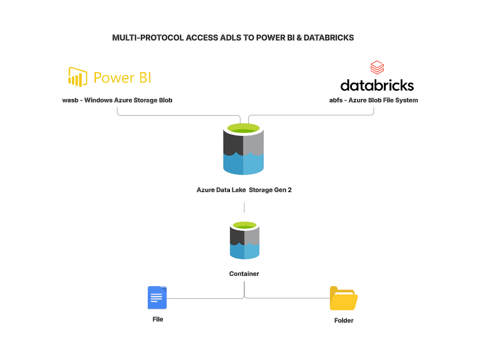

# Multi-Protocol-Access-ADLS-Power-BI-Azure-Databricks

« Pour des raisons de sécurité, mes captures d'écran et mes notebooks qui contiennent les noms de ressources Azure internes ne sont disponibles que sur un repo privé. Veuillez demamder l'accès au besion »
For security reasons, my screenshots and notebooks containing internal Azure resource names are only available on a private repository. Please request access if needed.

### 🎯 Objectif

Ce projet démontre la configuration et l’utilisation de différents modes d’accès (multi-protocol access) à des données stockées dans Azure Data Lake Storage Gen2 (ADLS) vers Power BI et Azure Databricks.
C'est un projet d’intégration et de gestion d’accès sécurisés au sein de l’écosystème Microsoft Azure.

### 🔧 Services et technologies utilisés

Azure Data Lake Storage Gen2 (ADLS) – Stockage hiérarchique

Azure Blob Storage – Conteneur de fichiers CSV publics (ex : NYPD Arrests dataset)

Power BI Desktop – Connexion via wasbs:// (Blob Storage REST endpoint)

Azure Databricks – Connexion via abfss:// (Data Lake endpoint) avec :

Account Key Authentication

Service Principal Authentication (via Microsoft Entra ID → App Registration)

Key Vault-backed Secret Scope

Azure Key Vault – Gestion sécurisée des secrets (client ID, client secret, account key)

Databricks Secret Scope – Stockage des clés pour l'accès aux ressources

Hive Metastore  – Enregistrement automatique de la table au format Delta

### 🔑 Méthodes d’authentification démontrées
 1. Account Key Authentication (clé d’accès directe du compte de stockage)

Utilisation de la propriété fs.azure.account.key.<STORAGE_ACCOUNT>.dfs.core.windows.net

Accès configuré depuis Databricks via spark.conf.set(...)

 2. Service Principal Authentication (recommandé pour production)

Création d’un App Registration dans Microsoft Entra ID

Attribution des rôles (Storage Blob Data Contributor, Storage Blob Data Owner)

Gestion des permissions via ACL (Access Control Lists) sur les chemins ADLS

### ✅ Résultats obtenus

Fichier CSV chargé depuis ADLS et injecté :

dans Power BI via wasbs://

dans Azure Databricks via abfss://

Table Delta créée dans Databricks et enregistrée dans le Hive Metastore

Accès sécurisé géré avec 2 méthodes d’authentification

Clés et secrets protégés via Azure Key Vault et Databricks Secret Scope
